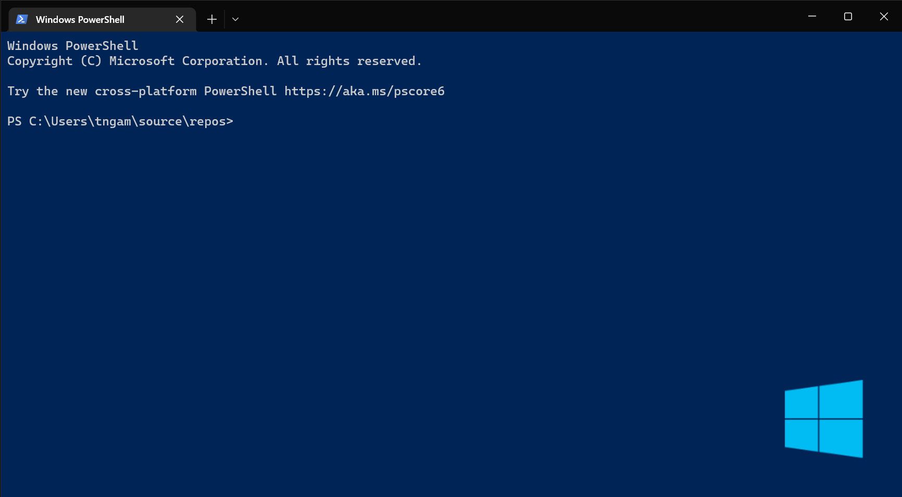
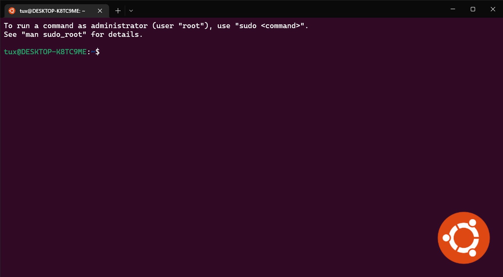

# Windows-Terminal
My Windows Terminal configuration files and assets.

## Custom Themes

### Windows PowerShell Theme


### PowerShell Theme


### Command Prompt Theme


### Ubuntu Linux Theme


## Installing and running Windows Terminal

> 👉 Note: Windows Terminal requires Windows 10 1903 (build 18362) or later

### Microsoft Store [Recommended]

Install the [Windows Terminal from the Microsoft Store](https://aka.ms/terminal). This allows you to always be on the latest version when we release new builds with automatic upgrades.

This is the preferred method.

### Other install methods

#### Via Windows Package Manager CLI (aka winget)

[winget](https://github.com/microsoft/winget-cli) users can download and install the latest Terminal release by installing the `Microsoft.WindowsTerminal` package:

```powershell
winget install --id=Microsoft.WindowsTerminal -e
```

#### Via Chocolatey (unofficial)

[Chocolatey](https://chocolatey.org) users can download and install the latest Terminal release by installing the `microsoft-windows-terminal` package:

```powershell
choco install microsoft-windows-terminal
```

To upgrade Windows Terminal using Chocolatey, run the following:

```powershell
choco upgrade microsoft-windows-terminal
```

If you have any issues when installing/upgrading the package please go to the [Windows Terminal package page](https://chocolatey.org/packages/microsoft-windows-terminal) and follow the [Chocolatey triage process](https://chocolatey.org/docs/package-triage-process)

## How To Use

To clone and run this repository you'll need [Git](https://git-scm.com) and [Windows Terminal](https://github.com/microsoft/terminal) installed on your computer. From your command line:

```bash
# Clone this repository
git clone https://github.com/Adobe-Android/Windows-Terminal.git
# Go into the repository
cd Windows-Terminal
```

Copy and paste the contents of the included **settings.json** file into your own **settings.json**.
You can access your **settings.json** file by opening the Windows Terminal and clicking the Settings option in the drop-down menu.


Be sure to change the paths for the **backgroundImage** property to wherever you decide to put the included assets.


That's it. You should now be up and running with the included custom themes and assets! Feel free to open a [GitHub Issue](https://github.com/Adobe-Android/Windows-Terminal/issues/new) if you find anything to be lacking.

## License
[MIT](LICENSE)
